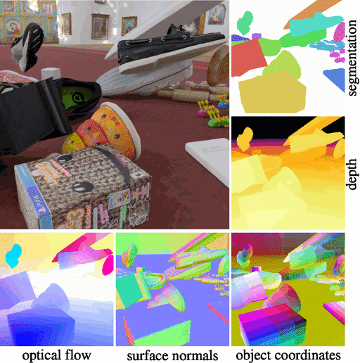

# Kubric

[](https://github.com/google-research/kubric/actions/workflows/blender.yml)
[](https://github.com/google-research/kubric/actions/workflows/kubruntu.yml)
[](https://github.com/google-research/kubric/actions/workflows/test.yml)
[](https://codecov.io/github/google-research/kubric)
[](https://kubric.readthedocs.io/en/latest/)

A data generation pipeline for creating semi-realistic synthetic multi-object 
videos with rich annotations such as instance segmentation masks, depth maps, 
and optical flow.




## Motivation and design
We need better data for training and evaluating machine learning systems, especially in the collntext of unsupervised multi-object video understanding.
Current systems succeed on [toy datasets](https://github.com/deepmind/multi_object_datasets), but fail on real-world data.
Progress could be greatly accelerated if we had the ability to create suitable datasets of varying complexity on demand.
Kubric is mainly built on-top of pybullet (for physics simulation) and Blender (for rendering); however, the code is kept modular to potentially support different rendering backends.

## Getting started
For instructions, please refer to [https://kubric.readthedocs.io](https://kubric.readthedocs.io)

Assuming you have docker installed, to generate the data above simply execute:
```
git clone https://github.com/google-research/kubric.git
cd kubric
docker pull kubricdockerhub/kubruntu
docker run --rm --interactive \
           --user $(id -u):$(id -g) \
           --volume "$(pwd):/kubric" \
           kubricdockerhub/kubruntu \
           /usr/bin/python3 examples/helloworld.py
ls output
```

Kubric employs **Blender 2.93** (see [here](https://github.com/google-research/kubric/blob/01a08d274234f32f2adc4f7d5666b39490f953ad/docker/Blender.Dockerfile#L48)), so if you want to inspect the generated `*.blend` scene file for interactive inspection (i.e. without needing to render the scene), please make sure you have installed the correct Blender version. 

## Requirements
- A pipeline for conveniently generating video data. 
- Physics simulation for automatically generating physical interactions between multiple objects.
- Good control over the complexity of the generated data, so that we can evaluate individual aspects such as variability of objects and textures.
- Realism: Ideally, the ability to span the entire complexity range from CLEVR all the way to real-world video such as YouTube8. This is clearly not feasible, but we would like to get as close as possible. 
- Access to rich ground truth information about the objects in a scene for the purpose of evaluation (eg. object segmentations and properties)
- Control the train/test split to evaluate compositionality and systematic generalization (for example on held-out combinations of features or objects)


## Challenges and datasets
Generally, we store datasets for the challenges in this [Google Cloud Bucket](https://console.cloud.google.com/storage/browser/kubric-public).
More specifically, these challenges are *dataset contributions* of the Kubric CVPR'22 paper:
* [MOVi: Multi-Object Video](challenges/movi)
* [Texture-Structure in NeRF](challenges/texture_structure_nerf)
* [Optical Flow](challenges/optical_flow)
* [Pre-training Visual Representations](challenges/pretraining_visual)
* [Robust NeRF](challenges/robust_nerf)
* [Multi-View Object Matting](challenges/multiview_matting)
* [Complex BRDFs](challenges/complex_brdf)
* [Single View Reconstruction](challenges/single_view_reconstruction)
* [Video Based Reconstruction](challenges/video_based_reconstruction)
* [Point Tracking](challenges/point_tracking)

Pointers to additional datasets/workers:
* [ToyBox (from Neural Semantic Fields)](https://nesf3d.github.io)
* [MultiShapeNet (from Scene Representation Transformer)](https://srt-paper.github.io)
* [SyntheticTrio(from Controllable Neural Radiance Fields)](https://github.com/kacperkan/conerf-kubric-dataset#readme)

## Bibtex
```
@article{greff2021kubric,
    title = {Kubric: a scalable dataset generator}, 
    author = {Klaus Greff and Francois Belletti and Lucas Beyer and Carl Doersch and
              Yilun Du and Daniel Duckworth and David J Fleet and Dan Gnanapragasam and
              Florian Golemo and Charles Herrmann and Thomas Kipf and Abhijit Kundu and
              Dmitry Lagun and Issam Laradji and Hsueh-Ti (Derek) Liu and Henning Meyer and
              Yishu Miao and Derek Nowrouzezahrai and Cengiz Oztireli and Etienne Pot and
              Noha Radwan and Daniel Rebain and Sara Sabour and Mehdi S. M. Sajjadi and Matan Sela and
              Vincent Sitzmann and Austin Stone and Deqing Sun and Suhani Vora and Ziyu Wang and
              Tianhao Wu and Kwang Moo Yi and Fangcheng Zhong and Andrea Tagliasacchi},
    booktitle = {Proceedings of the IEEE Conference on Computer Vision and Pattern Recognition (CVPR)},
    year = {2022},
}
```

## Disclaimer
This is not an official Google Product
