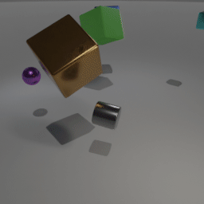
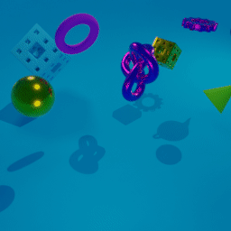
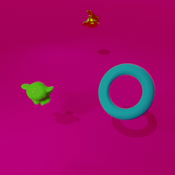
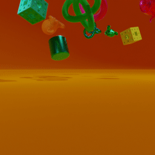
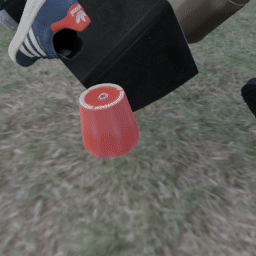
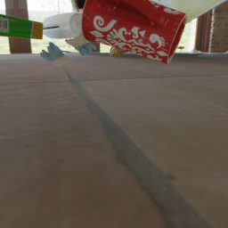
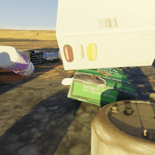
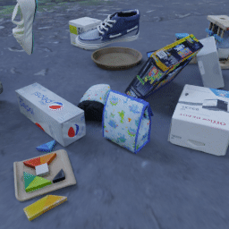
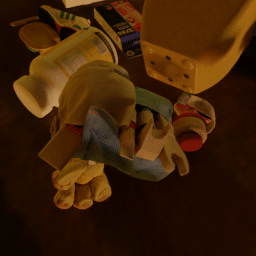
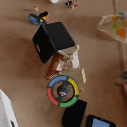

# Multi-Object Video (MOVi) datasets


The MOVi dataset is really a series of five datasets (MOVi-A to MOVi-E) with increasing complexity.
Each dataset consists of random scenes, each being a 2 second rigid body simulation with a few objects falling.
The variants differ in various dimensions including the number and type of objects, background, camera position/movement, and wether all objects are tossed or if some remain static.
Unless otherwise specified, each variant contains about 9.75k training images and 250 validation images, rendered at a resolution of 256x256 at 12fps for a total of 24 frames.
Each dataset also comes with a downsampled variant at a resolution of 128x128. 
They can be loaded like this:
``` python
ds = tfds.load("movi_a/256x256", data_dir="gs://kubric-public/tfds") 
ds = tfds.load("movi_a/128x128", data_dir="gs://kubric-public/tfds") 
```
Refer to the [VisualizeMOVi.ipynb](VisualizeMOVi.ipynb) notebook for an example of loading and visualizing the datasets. 

Variants C, D, and E also include a `"test"` split with scenes that exclusively consist of held-out objects and background images to test generalization.  

## Variants
### MOVi-A



MOVi-A is based on the CLEVR dataset.
The scene consists of a gray floor, four light sources, a camera, and between
3 and 10 random objects.
The camera position is randomly jittered in a small area around a fixed position
and always points at the origin.
The objects are randomly chosen from:
- one three shapes [cube, sphere, cylinder],
- scaled to one of two sizes [small, large],
- have one of two materials [rubber, metal],
- and one of eight colors [blue, brown, cyan, gray, green, purple, red, yellow]

Generate single scene [movi_ab_worker.py](movi_ab_worker.py) script:
```shell
docker run --rm --interactive \
  --user $(id -u):$(id -g)    \
  --volume "$(pwd):/kubric"   \
  kubricdockerhub/kubruntu    \
  /usr/bin/python3 challenges/movi/movi_ab_worker.py \
  --objects_set=clevr          \
  --background=clevr          \
  --camera=clevr
```
See [movi_a.py](movi_a.py) for the TFDS definition / conversion.
``` python
ds = tfds.load("movi_a", data_dir="gs://kubric-public/tfds") 
```
#### Variant specific Annotations
In addition to the general information (see below), MOVi-A contains the following additional information:
- **"instance"**
  - **"shape_label"**:  
    Choice of `["cube", "cylinder", "sphere"]`
  - **"size_label"**:  
    Choice of `["small", "large"]`
  - **"color"**: `(3,) [float32]`  
    Color of the object in RGB.
  - **"color_label"**:  
    One of `["blue", "brown", "cyan", "gray", "green", "purple", "red", "yellow"]`
  - **"material_label"**:  
    One of `["metal", "rubber"]`


<details>
  <summary>Full format and shapes</summary>

``` python
{
  "metadata": {
    "video_name": int,
    "depth_range": (2,),
    "forward_flow_range": (2,),
    "backward_flow_range": (2,),
    "num_frames": 24,
    "num_instances": int,
    "height": 256,
    "width": 256
  },
  "camera": {
    "field_of_view": 0.85755605,
    "focal_length": 35.0,
    "positions": (24, 3),
    "quaternions": (24, 4),
    "sensor_width": 32.0
  },
  "instances": {
    "angular_velocities": (nr_instances, 24, 3),
    "bbox_frames": TensorShape([nr_instances, None]),
    "bboxes": TensorShape([nr_instances, None, 4]),
    "bboxes_3d": (nr_instances, 24, nr_instances, 3),
    "color": (nr_instances, 3),
    "color_label": (nr_instances,),
    "friction": (nr_instances,),
    "image_positions": (nr_instances, 24, 2),
    "mass": (nr_instances,),
    "material_label": (nr_instances,),
    "positions": (nr_instances, 24, 3),
    "quaternions": (nr_instances, 24, 4),
    "restitution": (nr_instances,),
    "shape_label": (nr_instances,),
    "size_label": (nr_instances,),
    "velocities": (nr_instances, 24, 3),
    "visibility": (nr_instances, 24)
  },
  "events": {
    "collisions": {
      "contact_normal": (2778, 3),
      "force": (2778,),
      "frame": (2778,),
      "image_position": (2778, 2),
      "instances": (2778, 2),
      "position": (2778, 3)
    }
  },
  "depth": (24, 256, 256, 1),
  "forward_flow": (24, 256, 256, 2),
  "backward_flow": (24, 256, 256, 2),
  "normal": (24, 256, 256, 3),
  "object_coordinates": (24, 256, 256, 3),
  "segmentations": (24, 256, 256, 1),
  "video": (24, 256, 256, 3)
}
 ```

</details>


### MOVi-B





MOVi-B is a straightforward extension of MOVi-A that varies the following dimensions:
- 8 additional object shapes ["cone", "torus", "gear", "torus_knot", "sponge", "spot", "teapot", "suzanne"]
- camera is randomly placed in a half-sphere shell looking at the center of the scene
- hue of the objects is sampled randomly from a uniform distribution
- scale is sampled uniformly between 0.7 (small) and 1.4 (large)
- background has random color (uniformly sampled hue)

Generate single scene with the [movi_ab_worker.py](movi_ab_worker.py) script:
```shell
docker run --rm --interactive \
  --user $(id -u):$(id -g)    \
  --volume "$(pwd):/kubric"   \
  kubricdockerhub/kubruntu    \
  /usr/bin/python3 challenges/movi/movi_ab_worker.py \
  --objects_set=kubasic       \
  --background=colored        \
  --camera=random
```
See [movi_b.py](movi_b.py) for the TFDS definition / conversion.
``` python
ds = tfds.load("movi_b", data_dir="gs://kubric-public/tfds") 
```

#### Variant specific Annotations
In addition to the general information (see below), MOVi-B contains the following additional information:
- **"background_color"**: `(3,) [float32]`  
  Color of the background in RGB.
- **"instance"**
  - **"shape_label"**:  
    One of `["cube", "cylinder", "sphere", "cone", "torus", "gear", "torus_knot", "sponge", "spot", "teapot", "suzanne"]`
  - **"scale"**: `[float32]`    
    Scale of the object (between 0.7 and 1.4).
  - **"color"**: `(3,) [float32]`  
    Color of the object in RGB.
  - **"material_label"**:  
    One of `["metal", "rubber"]`

<details>
  <summary>Full format and shapes</summary>

``` python
{
  "metadata": {
    "video_name": int,
    "depth_range": (2,),
    "forward_flow_range": (2,),
    "backward_flow_range": (2,),
    "num_frames": 24,
    "num_instances": int,
    "height": 256,
    "width": 256,
    "background_color": (3,)
  },
  "camera": {
    "field_of_view": 0.85755605,
    "focal_length": 35.0,
    "positions": (24, 3),
    "quaternions": (24, 4),
    "sensor_width": 32.0
  },
  "instances": {
    "angular_velocities": (nr_instances, 24, 3),
    "bbox_frames": TensorShape([nr_instances, None]),
    "bboxes": TensorShape([nr_instances, None, 4]),
    "bboxes_3d": (nr_instances, 24, nr_instances, 3),
    "color": (nr_instances, 3),
    "friction": (nr_instances,),
    "image_positions": (nr_instances, 24, 2),
    "mass": (nr_instances,),
    "material_label": (nr_instances,),
    "positions": (nr_instances, 24, 3),
    "quaternions": (nr_instances, 24, 4),
    "restitution": (nr_instances,),
    "shape_label": (nr_instances,),
    "scale": (nr_instances,),
    "velocities": (nr_instances, 24, 3),
    "visibility": (nr_instances, 24)
  },
  "events": {
    "collisions": {
      "contact_normal": (2778, 3),
      "force": (2778,),
      "frame": (2778,),
      "image_position": (2778, 2),
      "instances": (2778, 2),
      "position": (2778, 3)
    }
  },
  "depth": (24, 256, 256, 1),
  "forward_flow": (24, 256, 256, 2),
  "backward_flow": (24, 256, 256, 2),
  "normal": (24, 256, 256, 3),
  "object_coordinates": (24, 256, 256, 3),
  "segmentations": (24, 256, 256, 1),
  "video": (24, 256, 256, 3)
}
 ```

</details>

## MOVi-C




MOVi-C is a big step up in complexity. 
Instead of simple uniformly colored shapes, it uses realistic, richly textured everyday objects from the [Google Scanned Objects (GSO)](https://app.ignitionrobotics.org/GoogleResearch/fuel/collections/Google%20Scanned%20Objects) dataset.
Furthermore, the background is replaced by a random HDRI from [Poly Haven](https://polyhaven.com/hdris) that is projected onto a dome and serves as floor, background and lighting simultaneously.


Generate single scene with the [movi_c_worker.py](movi_c_worker.py) script:
```shell
docker run --rm --interactive \
  --user $(id -u):$(id -g)    \
  --volume "$(pwd):/kubric"   \
  kubricdockerhub/kubruntu    \
  /usr/bin/python3 challenges/movi/movi_c_worker.py \
  --camera=fixed_random
```
See [movi_c.py](movi_c.py) for the TFDS definition / conversion.

``` python
ds = tfds.load("movi_c", data_dir="gs://kubric-public/tfds") 
```
#### Variant specific Annotation
- **"background"**: `str`  
  Name of the background HDRI.
- **"instance"***:
  - **"asset_id"**: `str`    
    Asset id from Google Scanned Objects dataset.
  - **"scale"**: `[float32]`    
    Scale of the object (between 0.75 and 3.0).
  - **"category"**:
    One of `["Action Figures", "Bag", "Board Games",
    "Bottles and Cans and Cups", "Camera",
    "Car Seat", "Consumer Goods", "Hat",
    "Headphones", "Keyboard", "Legos",
    "Media Cases", "Mouse", "None", "Shoe",
    "Stuffed Toys", "Toys"]`

<details>
  <summary>Full format and shapes</summary>

``` python
{
  "metadata": {
    "video_name": int,
    "depth_range": (2,),
    "forward_flow_range": (2,),
    "backward_flow_range": (2,),
    "num_frames": 24,
    "num_instances": int,
    "height": 256,
    "width": 256
  },
  "background": str
  "camera": {
    "field_of_view": 0.85755605,
    "focal_length": 35.0,
    "positions": (24, 3),
    "quaternions": (24, 4),
    "sensor_width": 32.0
  },
  "instances": {
    "angular_velocities": (nr_instances, 24, 3),
    "asset_id": (nr_instances,),
    "bbox_frames": TensorShape([nr_instances, None]),
    "bboxes": TensorShape([nr_instances, None, 4]),
    "bboxes_3d": (nr_instances, 24, 8, 3),
    "category": (nr_instances,),
    "friction": (nr_instances,),
    "image_positions": (nr_instances, 24, 2),
    "mass": (nr_instances,),
    "positions": (nr_instances, 24, 3),
    "quaternions": (nr_instances, 24, 4),
    "restitution": (nr_instances,),
    "scale": (nr_instances,),
    "velocities": (nr_instances, 24, 3),
    "visibility": (nr_instances, 24)
  },
  
  "events": {
    "collisions": {
      "contact_normal": (2778, 3),
      "force": (2778,),
      "frame": (2778,),
      "image_position": (2778, 2),
      "instances": (2778, 2),
      "position": (2778, 3)
    }
  },
  "depth": (24, 256, 256, 1),
  "forward_flow": (24, 256, 256, 2),
  "backward_flow": (24, 256, 256, 2),
  "normal": (24, 256, 256, 3),
  "object_coordinates": (24, 256, 256, 3),
  "segmentations": (24, 256, 256, 1),
  "video": (24, 256, 256, 3)
}
 ```

</details>

### MOVi-D




MOVi-D slightly increases scene complexity by using more objects with most of them starting the scene lying still on the floor.
Concretely each scene consists of 10-20 static objects and only 1-3 dynamic objects that are tossed onto the scene like in the other datasets.
This variant is meant to test for larger number of objects, and the models ability to handle non-moving objects.

Generate single scene with the [movi_def_worker.py](movi_def_worker.py) script:
```shell
docker run --rm --interactive \
  --user $(id -u):$(id -g)    \
  --volume "$(pwd):/kubric"   \
  kubricdockerhub/kubruntu    \
  /usr/bin/python3 challenges/movi/movi_def_worker.py \
  --camera=fixed_random
```
See [movi_d.py](movi_d.py) for the TFDS definition / conversion.

``` python
ds = tfds.load("movi_d", data_dir="gs://kubric-public/tfds") 
```

#### Variant specific Annotation
- **"background"**: `str`  
  Name of the background HDRI.
- **"instance"***:
  - **"asset_id"**: `str`    
    Asset id from Google Scanned Objects dataset.
  - **"scale"**: `[float32]`    
    Scale of the object (between 0.75 and 3.0).
  - **"category"**:
    One of `["Action Figures", "Bag", "Board Games",
    "Bottles and Cans and Cups", "Camera",
    "Car Seat", "Consumer Goods", "Hat",
    "Headphones", "Keyboard", "Legos",
    "Media Cases", "Mouse", "None", "Shoe",
    "Stuffed Toys", "Toys"]`
  - **"is_dynamic"**: `bool`    
    Indicating whether (at the start of the scene) the object
    is sitting on the floor (`False`) or is being tossed (`True`).

<details>
  <summary>Full format and shapes</summary>

``` python
{
  "metadata": {
    "video_name": int,
    "depth_range": (2,),
    "forward_flow_range": (2,),
    "backward_flow_range": (2,),
    "num_frames": 24,
    "num_instances": int,
    "height": 256,
    "width": 256
  },
  "background": str
  "camera": {
    "field_of_view": 0.85755605,
    "focal_length": 35.0,
    "positions": (24, 3),
    "quaternions": (24, 4),
    "sensor_width": 32.0
  },
  "instances": {
    "angular_velocities": (nr_instances, 24, 3),
    "asset_id": (nr_instances,),
    "bbox_frames": TensorShape([nr_instances, None]),
    "bboxes": TensorShape([nr_instances, None, 4]),
    "bboxes_3d": (nr_instances, 24, 8, 3),
    "category": (nr_instances,),
    "friction": (nr_instances,),
    "image_positions": (nr_instances, 24, 2),
    "is_dynamic': (nr_instances,)"
    "mass": (nr_instances,),
    "positions": (nr_instances, 24, 3),
    "quaternions": (nr_instances, 24, 4),
    "restitution": (nr_instances,),
    "scale": (nr_instances,),
    "velocities": (nr_instances, 24, 3),
    "visibility": (nr_instances, 24)
  },
  
  "events": {
    "collisions": {
      "contact_normal": (2778, 3),
      "force": (2778,),
      "frame": (2778,),
      "image_position": (2778, 2),
      "instances": (2778, 2),
      "position": (2778, 3)
    }
  },
  "depth": (24, 256, 256, 1),
  "forward_flow": (24, 256, 256, 2),
  "backward_flow": (24, 256, 256, 2),
  "normal": (24, 256, 256, 3),
  "object_coordinates": (24, 256, 256, 3),
  "segmentations": (24, 256, 256, 1),
  "video": (24, 256, 256, 3)
}
 ```
</details>

### MOVi-E




MOVi-E introduces simple (linear) camera movement.
The camera moves on a straight line with a random (but constant) velocity.
The starting point is sampled randomly in a half-sphere shell around the scene 
(inner_radius = 8, outer_radius = 12, and at least 0.1 abover the floor).
From there the camera moves into a random direction between 0 and 4 units.
This sampling process is repeated until a trajectory is found that starts and
ends within the specified half-sphere shell around the center of the scene.
The camera always points towards the origin.

Generate single scene with the [movi_def_worker.py](movi_def_worker.py) script:
```shell
docker run --rm --interactive \
  --user $(id -u):$(id -g)    \
  --volume "$(pwd):/kubric"   \
  kubricdockerhub/kubruntu    \
  /usr/bin/python3 challenges/movi/movi_def_worker.py \
  --camera=linear_movement
```
See [movi_e.py](movi_e.py) for the TFDS definition / conversion.

``` python
ds = tfds.load("movi_e", data_dir="gs://kubric-public/tfds") 
```
#### Variant specific Annotation
- **"background"**: `str`  
  Name of the background HDRI.
- **"instance"***:
  - **"asset_id"**: `str`    
    Asset id from Google Scanned Objects dataset.
  - **"scale"**: `[float32]`    
    Scale of the object (between 0.75 and 3.0).
  - **"category"**:
    One of `["Action Figures", "Bag", "Board Games",
    "Bottles and Cans and Cups", "Camera",
    "Car Seat", "Consumer Goods", "Hat",
    "Headphones", "Keyboard", "Legos",
    "Media Cases", "Mouse", "None", "Shoe",
    "Stuffed Toys", "Toys"]`
  - **"is_dynamic"**: `bool`    
    Indicating whether (at the start of the scene) the object
    is sitting on the floor (`False`) or is being tossed (`True`).
  
<details>
  <summary>Full format and shapes</summary>

``` python
{
  "metadata": {
    "video_name": int,
    "depth_range": (2,),
    "forward_flow_range": (2,),
    "backward_flow_range": (2,),
    "num_frames": 24,
    "num_instances": int,
    "height": 256,
    "width": 256
  },
  "background": str
  "camera": {
    "field_of_view": 0.85755605,
    "focal_length": 35.0,
    "positions": (24, 3),
    "quaternions": (24, 4),
    "sensor_width": 32.0
  },
  "instances": {
    "angular_velocities": (nr_instances, 24, 3),
    "asset_id": (nr_instances,),
    "bbox_frames": TensorShape([nr_instances, None]),
    "bboxes": TensorShape([nr_instances, None, 4]),
    "bboxes_3d": (nr_instances, 24, 8, 3),
    "category": (nr_instances,),
    "friction": (nr_instances,),
    "image_positions": (nr_instances, 24, 2),
    "is_dynamic': (nr_instances,)"
    "mass": (nr_instances,),
    "positions": (nr_instances, 24, 3),
    "quaternions": (nr_instances, 24, 4),
    "restitution": (nr_instances,),
    "scale": (nr_instances,),
    "velocities": (nr_instances, 24, 3),
    "visibility": (nr_instances, 24)
  },
  
  "events": {
    "collisions": {
      "contact_normal": (2778, 3),
      "force": (2778,),
      "frame": (2778,),
      "image_position": (2778, 2),
      "instances": (2778, 2),
      "position": (2778, 3)
    }
  },
  "depth": (24, 256, 256, 1),
  "forward_flow": (24, 256, 256, 2),
  "backward_flow": (24, 256, 256, 2),
  "normal": (24, 256, 256, 3),
  "object_coordinates": (24, 256, 256, 3),
  "segmentations": (24, 256, 256, 1),
  "video": (24, 256, 256, 3)
}
 ```
</details>

### MOVi-F


MOVi-F was generated for training optical flow predictors and is identical to MOVi-E except that it adds a random amount of motion blur to each video and was rendered in 512x512 resolution (with downscaled variants for 256x256 and 128x128).

Generate single scene with the [movi_def_worker.py](movi_def_worker.py) script:
```shell
docker run --rm --interactive \
  --user $(id -u):$(id -g)    \
  --volume "$(pwd):/kubric"   \
  kubricdockerhub/kubruntu    \
  /usr/bin/python3 challenges/movi/movi_def_worker.py \
  --camera=linear_movement
  --max_motion_blur=2.0
```
See [movi_f.py](movi_f.py) for the TFDS definition / conversion.

``` python
ds = tfds.load("movi_f", data_dir="gs://kubric-public/tfds") 
```
#### Variant specific Annotation
- **"metadata"**:
  - **"motion_blur"**: `[float32]`  
  The strength of motion blur between 0 and 2.
- **"background"**: `str`  
  Name of the background HDRI.
- **"instance"***:
  - **"asset_id"**: `str`    
    Asset id from Google Scanned Objects dataset.
  - **"scale"**: `[float32]`    
    Scale of the object (between 0.75 and 3.0).
  - **"category"**:
    One of `["Action Figures", "Bag", "Board Games",
    "Bottles and Cans and Cups", "Camera",
    "Car Seat", "Consumer Goods", "Hat",
    "Headphones", "Keyboard", "Legos",
    "Media Cases", "Mouse", "None", "Shoe",
    "Stuffed Toys", "Toys"]`
  - **"is_dynamic"**: `bool`    
    Indicating whether (at the start of the scene) the object
    is sitting on the floor (`False`) or is being tossed (`True`).

## Annotations and Format
Each sample is a dictionary which contains the following data:
(`s: sequence length, h: height, w: width, k: number of instances`):

- **"video"**: `(s, h, w, 3) [uint8]`  
  The RGB frames.
- **"segmentations"**: `(s, h, w, 1) [uint8]`  
  Instance segmentation as per-pixel object-id with `background=0`.  
  *Note: because of this the instance IDs used here are one higher than their
  corresponding index in `sample["instances"]`.*
- **"depth"**: `(s, h, w, 1) [uint16]`  
  Distance of each pixel from the center of the camera.
  *(Note this is different from the z-value sometimes used, which measures the
  distance to the camera **plane**.)*  
  The values are stored as `uint16` and span the range specified in
  `sample["metadata"]["depth_range"]`. To convert them back to world-units
  use:
  ```python
  minv, maxv = sample["metadata"]["depth_range"]
  depth = sample["depth"] / 65535 * (maxv - minv) + minv
  ```
- **"forward_flow"**: `(s, h, w, 2) [uint16]`  
  Forward optical flow in the form `(delta_row, delta_column)`.
  The values are stored as `uint16` and span the range specified in
  `sample["metadata"]["forward_flow_range"]`. To convert them back to pixels use:
  ```python
  minv, maxv = sample["metadata"]["forward_flow_range"]
  depth = sample["forward_flow"] / 65535 * (maxv - minv) + minv
  ```
- **"backward_flow"**: `(s, h, w, 2) [uint16]`  
  Backward optical flow in the form `(delta_row, delta_column)`.
  The values are stored as `uint16` and span the range specified in
  `sample["metadata"]["backward_flow_range"]`. To convert them back to pixels use:
  ```python
  minv, maxv = sample["metadata"]["backward_flow_range"]
  depth = sample["backward_flow"] / 65535 * (maxv - minv) + minv
  ```
- **"normal"**: `(s, h, w, 3) [uint16]`  
  Surface normals for each pixel in world coordinates.
- **"object_coordinates"**: `(s, h, w, 3) [uint16]`  
  Object coordinates encode the position of each point relative to the objects
  bounding box (i.e. back-left-top (X=Y=Z=1) corner is white,
  while front-right-bottom (X=Y=Z=0) corner is black.)
- **"instances"**
  Under this key there is rich instance-level information.  
  *Note that the instances are sorted by their total visibility (descending), 
  i.e. the total number pixels they occupy throughout the video.*  
  - **"mass"**: `(k,) [float32]`  
    Mass of the object used for simulation.
  - **"friction"**: `(k,) [float32]`  
    Friction coefficient used for simulation.
  - **"restitution"**: `(k,) [float32]`  
    Restitution coefficient (bounciness) used for simulation.
  - **"positions"**: `(k, s, 3) [float32]`  
    Position of the object for each frame in world-coordinates.
  - **"quaternions"**: `(k, s, 4) [float32]`  
    Rotation of the object for each frame as quaternions.
  - **"velocities"**: `(k, s, 3) [float32]`  
    Velocity of the object for each frame.
  - **"angular_velocities"**: `(k, s, 3) [float32]`  
    Angular velocity of the object for each frame.
  - **"bboxes_3d"**: `(k, s, 8, 3) [float32]`  
    World-space corners of the 3D bounding box around the object.
  - **"image_positions"**: `(k, s, 2) [float32]`  
    Normalized (0, 1) image-space (2D) coordinates of the center of mass of the
    object for each frame.
  - **"bboxes"**: `(k, None, 4) [float32]`  
    The normalized image-space (2D) coordinates of the bounding box
    `[ymin, xmin, ymax, xmax]` for all the frames in which the object is visible
    (as specified in bbox_frames).
  - **"bbox_frames"**: `(k, None) [int]`  
    A list of all the frames the object is visible.
  - **"visibility"**: `(k, s) [uint16]`  
    Visibility of the object in number of pixels for each frame (can be 0).
- **"camera"**
  This key contains detailed information about the camera.
  (given for each frame even if the camera is static):
  - **"focal_length"**: `[float32]` 
    Focal length of the camera in millimeters. 
  - **"sensor_width"**: `[float32]`  
    Width of the sensor of the camera in millimeters.
  - **"field_of_view"**: `[float32]`
    (horizontal) field of view angle of the camera in degrees.
  - **"positions"**: `(s, 3) [float32]`
    Position of the camera for each frame in world-coordinates.
  - **"quaternions"**: `(s, 4) [float32]`
    Rotation of the camera for each frame as quaternions.
- **"events"**
  - **"collisions"**
    This key contains information about collision events.
    - **"instances"**: `(2,) [uint16]`
      Indices of the two instance between which the collision happened.
      Note that collisions with the floor/background objects are marked with 65535
    - **"frame"**: `[int32]`
      Frame in which the collision happenend.
    - **"force"**: `[float32]`
      The force (strength) of the collision.
    - **"position"**: `(3,) [float32]`
      Position of the collision event in 3D world coordinates.
    - **"image_position"**: `(2,) [float32]`
      Position of the collision event projected onto normalized 2D image coordinates.
    - **"contact_normal"**: `(3,) [float32]`
      The normal-vector of the contact (direction of the force).