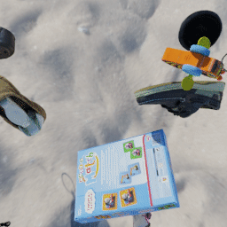

# Multi-Object Video (MOVi) datasets

The MOVi dataset is really a series of six datasets (MOVi-A to MOVi-E) with increasing complexity.
Each dataset consists of random scenes, each being a 2 second rigid body simulation with a few objects falling.
The variants differ in various dimensions including the number and type of objects, background, camera position/movement, and wether all objects are tossed or if some remain static.

## MOVi-A


MOVi-A is based on the CLEVR dataset.
The scene consists of a gray floor, four light sources, a camera, and between
3 and 10 random objects.
The camera position is randomly jittered in a small area around a fixed position
and always points at the origin.
The objects are randomly chosen from:
- one three shapes [cube, sphere, cylinder],
- scaled to one of two sizes [small, large],
- have one of two materials [rubber, metal],
- and one of eight colors [blue, brown, cyan, gray, green, purple, red, yellow]

Generate single scene [movi_ab_worker.py](movi_ab_worker.py) script:
```shell
docker run --rm --interactive \
  --user $(id -u):$(id -g)    \
  --volume "$(pwd):/kubric"   \
  kubricdockerhub/kubruntu    \
  /usr/bin/python3 challenges/movi/movi_ab_worker.py \
  --objects_set=clevr          \
  --background=clevr          \
  --camera=clevr
```
See [movi_a.py](movi_a.py) for the TFDS definition / conversion.
``` python
ds = tfds.load("movi_a", data_dir="gs://kubric-public/tfds") 
```
<details>
  <summary>Sample format and shapes</summary>

``` python
{
  "metadata": {
    "video_name": int,
    "depth_range": (2,),
    "forward_flow_range": (2,),
    "backward_flow_range": (2,),
    "num_frames": 24,
    "num_instances": int,
    "height": 256,
    "width": 256
  },
  "camera": {
    "field_of_view": 0.85755605,
    "focal_length": 35.0,
    "positions": (24, 3),
    "quaternions": (24, 4),
    "sensor_width": 32.0
  },
  "instances": {
    "angular_velocities": (nr_instances, 24, 3),
    "bbox_frames": TensorShape([nr_instances, None]),
    "bboxes": TensorShape([nr_instances, None, 4]),
    "bboxes_3d": (nr_instances, 24, nr_instances, 3),
    "color": (nr_instances, 3),
    "color_label": (nr_instances,),
    "friction": (nr_instances,),
    "image_positions": (nr_instances, 24, 2),
    "mass": (nr_instances,),
    "material_label": (nr_instances,),
    "positions": (nr_instances, 24, 3),
    "quaternions": (nr_instances, 24, 4),
    "restitution": (nr_instances,),
    "shape_label": (nr_instances,),
    "size_label": (nr_instances,),
    "velocities": (nr_instances, 24, 3),
    "visibility": (nr_instances, 24)
  },
  "events": {
    "collisions": {
      "contact_normal": (2778, 3),
      "force": (2778,),
      "frame": (2778,),
      "image_position": (2778, 2),
      "instances": (2778, 2),
      "position": (2778, 3)
    }
  },
  "depth": (24, 256, 256, 1),
  "forward_flow": (24, 256, 256, 2),
  "backward_flow": (24, 256, 256, 2),
  "normal": (24, 256, 256, 3),
  "object_coordinates": (24, 256, 256, 3),
  "segmentations": (24, 256, 256, 1),
  "video": (24, 256, 256, 3)
}
 ```

</details>


## MOVi-B


MOVi-B is a straightforward extension of MOVi-A that varies the following dimensions:
- 8 additional object shapes ["cone", "torus", "gear", "torus_knot", "sponge", "spot", "teapot", "suzanne"]
- camera is randomly placed in a half-sphere shell looking at the center of the scene
- hue of the objects is sampled randomly from a uniform distribution
- scale is sampled uniformly between 0.7 (small) and 1.4 (large)
- background has random color (uniformly sampled hue)

Generate single scene with the [movi_ab_worker.py](movi_ab_worker.py) script:
```shell
docker run --rm --interactive \
  --user $(id -u):$(id -g)    \
  --volume "$(pwd):/kubric"   \
  kubricdockerhub/kubruntu    \
  /usr/bin/python3 challenges/movi/movi_ab_worker.py \
  --objects_set=kubasic       \
  --background=colored        \
  --camera=random
```
See [movi_b.py](movi_b.py) for the TFDS definition / conversion.
``` python
ds = tfds.load("movi_b", data_dir="gs://kubric-public/tfds") 
```
<details>
  <summary>Sample format and shapes</summary>

``` python
{
  "metadata": {
    "video_name": int,
    "depth_range": (2,),
    "forward_flow_range": (2,),
    "backward_flow_range": (2,),
    "num_frames": 24,
    "num_instances": int,
    "height": 256,
    "width": 256,
    "background_color": (3,)
  },
  "camera": {
    "field_of_view": 0.85755605,
    "focal_length": 35.0,
    "positions": (24, 3),
    "quaternions": (24, 4),
    "sensor_width": 32.0
  },
  "instances": {
    "angular_velocities": (nr_instances, 24, 3),
    "bbox_frames": TensorShape([nr_instances, None]),
    "bboxes": TensorShape([nr_instances, None, 4]),
    "bboxes_3d": (nr_instances, 24, nr_instances, 3),
    "color": (nr_instances, 3),
    "friction": (nr_instances,),
    "image_positions": (nr_instances, 24, 2),
    "mass": (nr_instances,),
    "material_label": (nr_instances,),
    "positions": (nr_instances, 24, 3),
    "quaternions": (nr_instances, 24, 4),
    "restitution": (nr_instances,),
    "shape_label": (nr_instances,),
    "scale": (nr_instances,),
    "velocities": (nr_instances, 24, 3),
    "visibility": (nr_instances, 24)
  },
  "events": {
    "collisions": {
      "contact_normal": (2778, 3),
      "force": (2778,),
      "frame": (2778,),
      "image_position": (2778, 2),
      "instances": (2778, 2),
      "position": (2778, 3)
    }
  },
  "depth": (24, 256, 256, 1),
  "forward_flow": (24, 256, 256, 2),
  "backward_flow": (24, 256, 256, 2),
  "normal": (24, 256, 256, 3),
  "object_coordinates": (24, 256, 256, 3),
  "segmentations": (24, 256, 256, 1),
  "video": (24, 256, 256, 3)
}
 ```

</details>

## MOVi-C




MOVi-C is a big step up in complexity. 
Instead of simple uniformly colored shapes, it uses realistic, richly textured everyday objects from the [Google Scanned Objects (GSO)](https://app.ignitionrobotics.org/GoogleResearch/fuel/collections/Google%20Scanned%20Objects) dataset.
Furthermore, the background is replaced by a random HDRI from [Poly Haven](https://polyhaven.com/hdris) that is projected onto a dome and serves as floor, background and lighting simultaneously.


Generate single scene with the [movi_c_worker.py](movi_c_worker.py) script:
```shell
docker run --rm --interactive \
  --user $(id -u):$(id -g)    \
  --volume "$(pwd):/kubric"   \
  kubricdockerhub/kubruntu    \
  /usr/bin/python3 challenges/movi/movi_c_worker.py \
  --camera=fixed_random
```
See [movi_c.py](movi_c.py) for the TFDS definition / conversion.

``` python
ds = tfds.load("movi_c", data_dir="gs://kubric-public/tfds") 
```
<details>
  <summary>Sample format and shapes</summary>

``` python
{
  "metadata": {
    "video_name": int,
    "depth_range": (2,),
    "forward_flow_range": (2,),
    "backward_flow_range": (2,),
    "num_frames": 24,
    "num_instances": int,
    "height": 256,
    "width": 256
  },
  "camera": {
    "field_of_view": 0.85755605,
    "focal_length": 35.0,
    "positions": (24, 3),
    "quaternions": (24, 4),
    "sensor_width": 32.0
  },
  "instances": {
    "angular_velocities": (nr_instances, 24, 3),
    "bbox_frames": TensorShape([nr_instances, None]),
    "bboxes": TensorShape([nr_instances, None, 4]),
    "bboxes_3d": (nr_instances, 24, 8, 3),
    "category": (nr_instances,),
    "friction": (nr_instances,),
    "image_positions": (nr_instances, 24, 2),
    "mass": (nr_instances,),
    "positions": (nr_instances, 24, 3),
    "quaternions": (nr_instances, 24, 4),
    "restitution": (nr_instances,),
    "scale": (nr_instances,),
    "velocities": (nr_instances, 24, 3),
    "visibility": (nr_instances, 24)
  },
  
  "events": {
    "collisions": {
      "contact_normal": (2778, 3),
      "force": (2778,),
      "frame": (2778,),
      "image_position": (2778, 2),
      "instances": (2778, 2),
      "position": (2778, 3)
    }
  },
  "depth": (24, 256, 256, 1),
  "forward_flow": (24, 256, 256, 2),
  "backward_flow": (24, 256, 256, 2),
  "normal": (24, 256, 256, 3),
  "object_coordinates": (24, 256, 256, 3),
  "segmentations": (24, 256, 256, 1),
  "video": (24, 256, 256, 3)
}
 ```

</details>

## MOVi-D
(coming soon)

## MOVi-E
(coming soon)