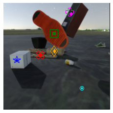
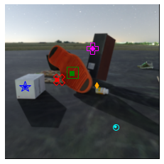

# Long-Term Point Tracking

For long-term point tracking we make use of the `objects_coordinates` annotation in the MOVi-E dataset, along with ground-truth positions of objects, camera, and depth maps to generate point-tracks.  Implementation-wise, `create_point_tracking_dataset()` is a simple wrapper around the default tfds Kubric loader which samples points and tracks them.  For a demo, run `python3 dataset.py`. This demo requires installation of `requirements_full.txt` as it depends on `tensorflow_graphics` and matplotlib.

