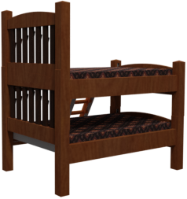

# ShapeNet Renders for Pre-Training Image Classifiers

This dataset contains each ShapeNet object rendered from 25 random perspectives on transparent background.
Images are rendered at 512x512 and then cropped to fit the object, so they vary in size:





``` python
ds = tfds.load("shapenet_pretraining", data_dir="gs://kubric-public/tfds") 
```

The dataset contains the following information:
- **"image_id"**: `str`
- **"asset_id"**: `str`  
  The id of the ShapeNet object. E.g. "02691156/1021a0914a7207aff927ed529ad90a11".
- **"label"**: `int`  
  One of the 55 Shapenet classes:
  ["airplane", "ashcan", "bag", "basket", "bathtub", "bed", "bench", "birdhouse",
  "bookshelf", "bottle", "bowl", "bus", "cabinet", "camera", "can", "cap", "car",
  "cellular telephone", "chair", "clock", "computer keyboard", "dishwasher",
  "display", "earphone", "faucet", "file", "guitar", "helmet", "jar", "knife",
  "lamp", "laptop", "loudspeaker", "mailbox", "microphone", "microwave",
  "motorcycle", "mug", "piano", "pillow", "pistol", "pot", "printer",
  "remote control", "rifle", "rocket", "skateboard", "sofa", "stove",
  "table", "telephone", "tower", "train", "vessel", "washer"]
- **"camera_position"**: `(3,) [float32]`
  position of the camera in a half-sphere shell with inner radius 9 and outer radius 10.
  The object sits at the origin.
- **"image"**:  `(None, None, 4) [uint8]`
  The rendered image in RGBA format, cropped to fit the object.


Generate single scene with the [shapenet_pretraining_worker.py](shapenet_pretraining_worker.py) script:
```shell
docker run --rm --interactive \
  --user $(id -u):$(id -g)    \
  --volume "$(pwd):/kubric"   \
  kubricdockerhub/kubruntu    \
  /usr/bin/python3 challenges/shapenet_pretraining/shapenet_pretraining_worker.py 
```
See [shapenet_pretraining.py](shapenet_pretraining.py) for the TFDS definition / conversion.

