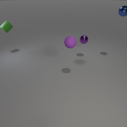
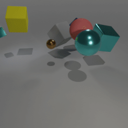
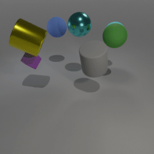
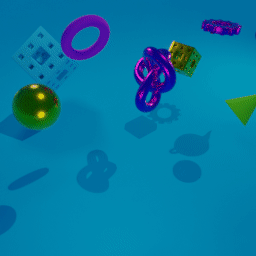
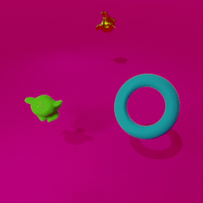
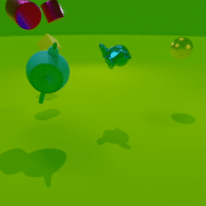

# Multi-Object Video (MOVi) datasets

The MOVi dataset is really a series of six datasets (MOVi-A to MOVi-E) with increasing complexity.
Each dataset consists of random scenes, each being a 2 second rigid body simulation with a few objects falling.
The variants differ in various dimensions including the number and type of objects, background, camera position/movement, and wether all objects are tossed or if some remain static.

## MOVi-A
[(Worker Script)](../../../examples/movi/movi_ab_worker.py)
[(TFDS Conversion)](../../../examples/movi/movi_a.py)
``` python
ds = tfds.load("movi_a", data_dir="gs://kubric-public/tfds") 
```





MOVi-A is based on the CLEVR dataset.
The scene consists of a gray floor, four light sources, a camera, and between
3 and 10 random objects.
The camera position is randomly jittered in a small area around a fixed position
and always points at the origin.
The objects are randomly chosen from:
- one three shapes [cube, sphere, cylinder],
- scaled to one of two sizes [small, large],
- have one of two materials [rubber, metal],
- and one of eight colors [blue, brown, cyan, gray, green, purple, red, yellow]


## MOVi-B
[(Worker Script)](../../../examples/movi/movi_ab_worker.py)
[(TFDS Conversion)](../../../examples/movi/movi_b.py)
``` python
ds = tfds.load("movi_b", data_dir="gs://kubric-public/tfds") 
```






MOVi-B is a straightforward extension of MOVi-A that varies the following dimensions:
- 8 additional object shapes ["cone", "torus", "gear", "torus_knot", "sponge", "spot", "teapot", "suzanne"]
- camera is randomly placed in a half-sphere shell looking at the center of the scene
- hue of the objects is sampled randomly from a uniform distribution
- scale is sampled uniformly between 0.7 (small) and 1.4 (large)
- background has random color (uniformly sampled hue)


## MOVi-C
(coming soon)

## MOVi-D
(coming soon)

## MOVi-E
(coming soon)