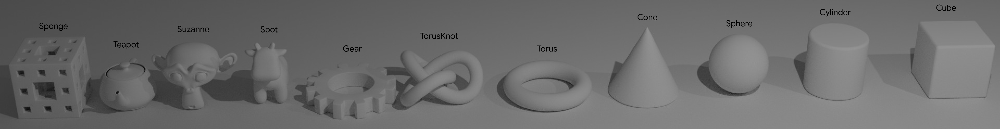

Assets
======

Each asset source is defined by a single manifest file in JSON format with the following entries:

name (str)
  Name of the asset source. Acts as a namespace for the asset ids. (e.g. “KuBasic”)
version (str)
  Version of the source repository
base_path (path)
  global path where to download the assets from  (e.g. ``gs://kubric-public/KuBasic``)
assets (List[dict])
  list of all the included Assets
description (str; optional)
  A textual description of the dataset

Each ``assets`` entry is a dictionary with the following information:

id (str)
  asset_id which doubles as default asset path (base_path + “/” + id + “.tar.gz”) unless path is explicitly given.
asset_type (enum) [FileBasedObject, Texture, Material, …]
  specifies the type of asset
path (path; optional)
  can be used to override the default id-based path.
license
  specifies the license of this asset
kwargs (dict)
  arguments that should be used to create this asset
metadata (dict)
  additional information about this asset that will be made accessible through `asset.metadata`

KuBasic
-------

- **License:** CC BY-SA 4.0
- **Manifest:**  `gs://kubric-public/assets/KuBasic/KuBasic.json <https://storage.googleapis.com/kubric-public/assets/KuBasic/KuBasic.json>`_

A collection of 11 simple shapes (no materials):
``['cone', 'cube', 'cylinder', 'gear', 'sphere', 'sponge', 'spot', 'suzanne', 'teapot', 'torus', 'torus_knot']``

Available metadata for each asset:

- nr_faces (int)
- nr_vertices (int)
- surface_area (float) in m²
- volume (float) in m³

