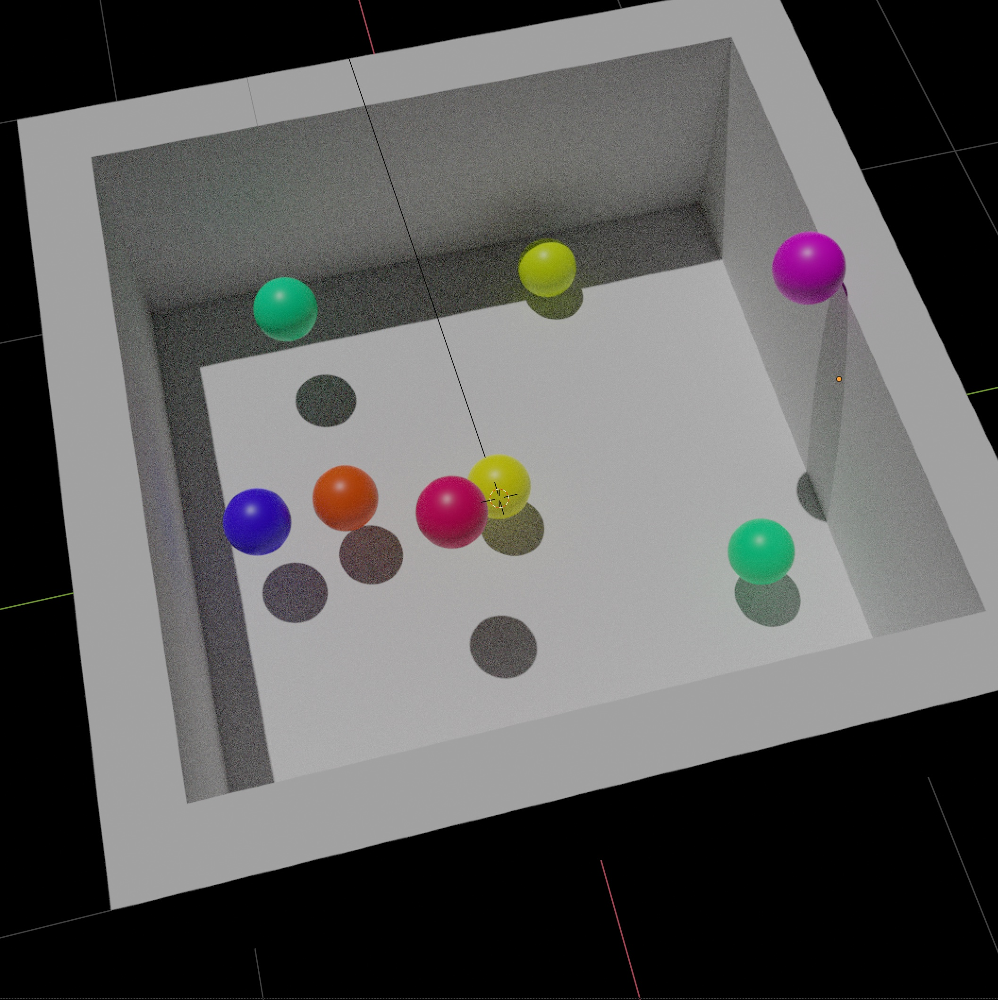

Getting Started
===============
The typical Kubric workflow involves a worker file, that describes the construction, simulation, rendering, and post-processing of a single video.
Because of its dependence on the Blender python module, installing kubric can be difficult.
The recommended way of using Kubric is thus via the `kubruntu <https://hub.docker.com/r/klausgreff/kubruntu>`_ Docker image, which contains a fully functional installation of Kubric with all its dependencies.
Assuming a functional `Docker installation <https://docs.docker.com/get-docker/>`_ this image can simply be downloaded like this (for more details see :ref:`installation instructions<installation>`):

.. code-block:: console

    docker pull kubricdockerhub/kubruntu

To run a ``worker.py`` file use:

.. code-block:: console

    docker run --rm --interactive --user $(id -u):$(id -g) -v "`pwd`:/kubric" -w /kubric kubricdockerhub/kubruntu python3 examples/getting_started.py

In the following we will create a series of simple workers that highlight different aspects of Kubric.
The code for these examples can also be found in the `examples directory <https://github.com/google-research/kubric/tree/main/examples>`_.

A Simple Worker
---------------
To get started let's create a very simple ``worker.py`` file that renders of a few bouncing balls.

Boilerplate
^^^^^^^^^^^
First, we need to create a (default) scene, a simulator and a renderer.
Currently only the pybullet simulator and the Blender renderer are supported so we'll use those:

.. code-block:: python
  :linenos:

  import numpy as np
  import kubric as kb

  scene = kb.Scene(resolution=(256, 256))
  simulator = kb.simulator.PyBullet(scene)
  renderer = kb.renderer.Blender(scene)

Scene Geometry
^^^^^^^^^^^^^^
Next we will create a square floor and four bounding walls and add them to the scene.
For this we resize and position five `kb.Cube` primitives, which by default creates a cube ranging from (-1, -1, -1) to (1, 1, 1):

.. code-block:: python
  :lineno-start: 7

  floor = kb.Cube(scale=(1, 1, 0.1), position=(0, 0, -0.1), static=True)
  north_wall = kb.Cube(scale=(1.2, 0.1, 1), position=(0, 1.1, 0.1), static=True)
  south_wall = kb.Cube(scale=(1.2, 0.1, 1), position=(0, -1.1, 0.1), static=True)
  east_wall = kb.Cube(scale=(0.1, 1, 1), position=(1.1, 0, 0.1), static=True)
  west_wall = kb.Cube(scale=(0.1, 1, 1), position=(-1.1, 0, 0.1), static=True)

  scene.add([floor, north_wall, south_wall, east_wall, west_wall])

The ``static=True`` argument ensures that the floor and walls remain fixed during the physics simulation, since we don't want them to react to gravity or topple.

Light and Camera
^^^^^^^^^^^^^^^^
Next we need to add a light, and a camera to the scene:

.. code-block:: python
  :lineno-start: 14

  sun = kb.DirectionalLight(position=(-1, -0.5, 3), look_at=(0, 0, 0), intensity=1.5)
  scene.add(sun)

  scene.camera = kb.PerspectiveCamera(position=(2, -0.5, 4), look_at=(0, 0, 0))

Note that we did not simply add the camera with ``scene.add``, but instead assigned it to ``scene.camera``, which sets it as the active camera for rendering (and also automatically adds it to the scene).

Preliminary Run
^^^^^^^^^^^^^^^
We can already export this scene as a Blender file to see what is happening:

.. code-block:: python
  :lineno-start: 19

  renderer.save_state("scene1.blend")

To execute our worker run the following command from the same directory as the ``worker.py`` file:

.. code-block:: console

  docker run  -v "`pwd`:/kubric" -it --rm  klausgreff/kubruntudev python3 worker.py

which gives us a ``scene1.blend`` file that looks like this:

.. image:: ../images/getting_started_blender_scene_2.png
   :width: 400pt

Colorful Balls
^^^^^^^^^^^^^^

Next, let us add a couple of colorful balls (:class:`~kubric.core.objects.Sphere` primitives) for bouncing around.
We use ``rng.uniform(low, high)`` to ensures that each ball is initialized at its own random random position within the range of the walls:

.. code-block:: python
  :lineno-start: 19

  rng = np.random.default_rng()
  spawn_region = [[-1, -1, 0], [1, 1, 1]]   # [low, high] bounds of spawning region
  for i in range(8):
    ball = kb.Sphere(scale=0.1, position=rng.uniform(*spawn_region))
    scene.add(ball)

One problem with relying on a random placement is that the balls might by accident intersect each other or the walls.
For spheres we could easily avoid this problem by manually checking the distance of each ball to all other objects and resampling the position in case of a collision.
But kubric provides a more convenient solution for this problem that can furthermore deal with arbitrary shapes: :func:`~kubric.randomness.move_until_no_overlap`.
This helper function re-samples the objects position (and rotation) until the simulator no longer detects any collisions:

.. code-block:: python
  :lineno-start: 25

    kb.move_until_no_overlap(ball, simulator, spawn_region=spawn_region)

So far these balls all share the default (diffuse gray) material.
To color them, we will use the :class:`~kubric.core.materials.PrincipledBSDFMaterial`.
This material is very versatile and can represent a wide range of materials including plastic, rubber, metal, wax, and glass (see e.g. `these examples from the blender documentation <https://docs.blender.org/manual/en/latest/render/shader_nodes/shader/principled.html#examples>`_).
But here we will stick to the default settings and only modify the color.

.. code-block:: python
  :lineno-start: 26

    ball.material = kb.PrincipledBSDFMaterial(color=kb.random_hue_color(rng=rng))

Finally, let us give each ball a random initial velocity. Combined with the code above we get:

.. code-block:: python
  :lineno-start: 19

  rng = np.random.default_rng()
  spawn_region = [[-1, -1, 0], [1, 1, 1]]   # [low, high] bounds of spawning region
  for i in range(8):
    ball = kb.Sphere(scale=0.1, position=rng.uniform(*spawn_region),
                     velocity=rng.uniform([-1, -1, 0], [1, 1, 0]))
    ball.material = kb.PrincipledBSDFMaterial(color=kb.random_hue_color(rng=rng))
    scene.add(ball)
    kb.move_until_no_overlap(ball, simulator, spawn_region=spawn_region)

The resulting scene looks like this:

Simulation
^^^^^^^^^^
Now that we have all the objects in place, it is time to run the simulation.
In Kubric this is very easy:

simulation.run

start_frame, end_frame, frame_rate, step_rate

export scene: motion paths

Rendering
^^^^^^^^^
renderer.render

resolution

output format

Post-Processing
^^^^^^^^^^^^^^^
exr -> pkl

Bonus: GIF
^^^^^^^^^^
how to turn this into an animated GIF?

Result: image!

